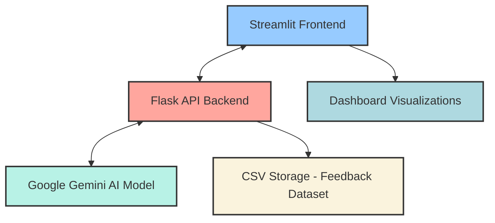
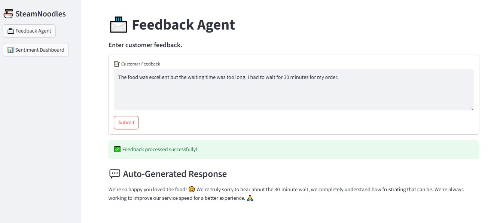
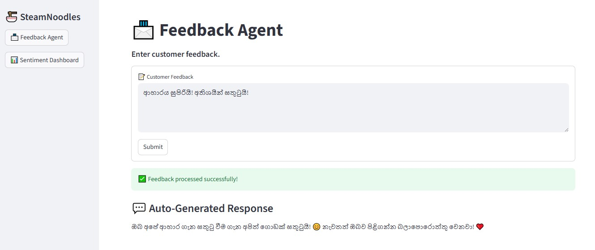
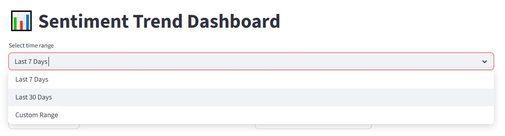
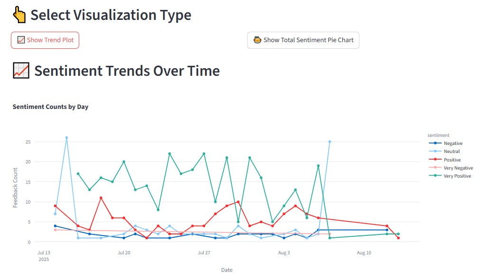
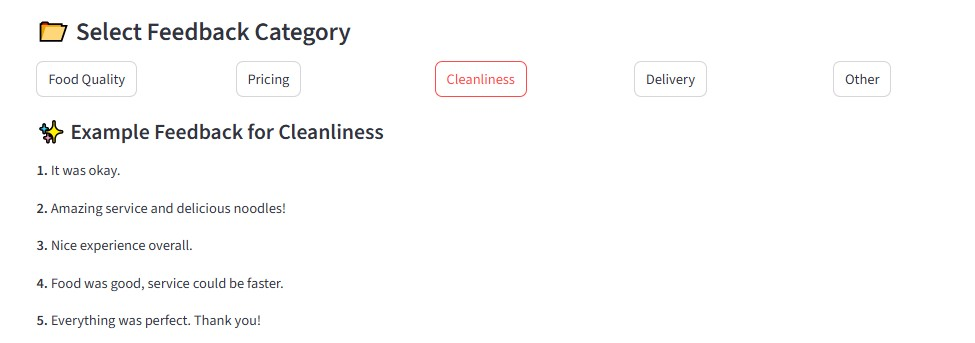
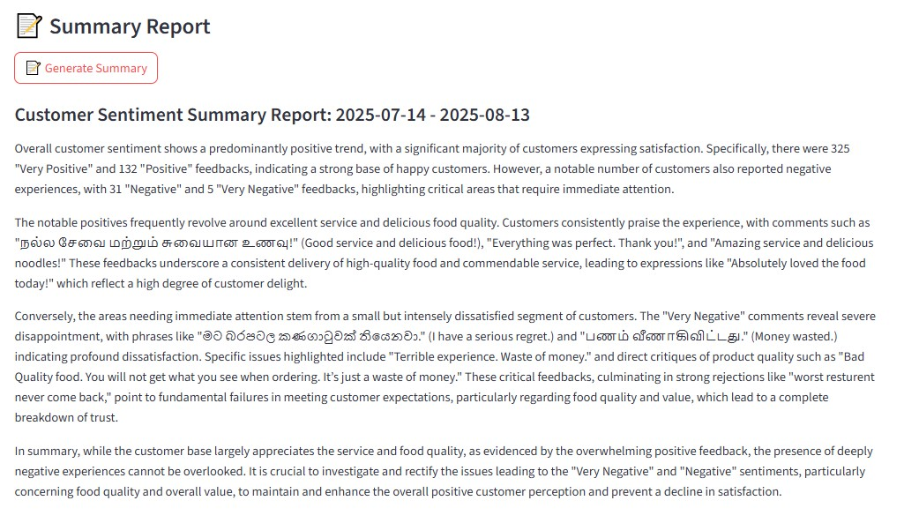

# SteamNoodles Feedback Agent System
An AI-powered customer feedback analysis system for SteamNoodles restaurant chain that provides real-time sentiment analysis, automated response generation, and comprehensive dashboard analytics.

## 📝 Developer Information
- **Name:** Sahan Udayanga
- **University:** University of Moratuwa
- **Year:** 3rd year

## 🍜 Project Overview
This project consists of two intelligent agents for SteamNoodles restaurant chain:

1. **Feedback Analysis Agent:**
   - Processes and responds to customer feedback with human-like, context-aware responses in multiple languages (English, Sinhala, Singlish, Tamil)
   - Multi-language Support: Analyzes feedback in English, Sinhala, and Tamil
   - Intelligent Analysis: Provides sentiment, urgency level, emotion detection, and business category classification
   - Automated Responses: Generates human-like, contextually appropriate replies in the same language as the feedback
   - Real-time Processing: Instant feedback analysis and response generation

2. **Sentiment Dashboard Agent:**
   - Visualizes sentiment trends over time and generates analytical summaries of customer feedback
   - Interactive Visualizations: Trend plots and pie charts for sentiment distribution
   - Flexible Time Ranges: Last 7 days, 30 days, or custom date ranges
   - Category Filtering: Filter feedback by business categories (Food Quality, Pricing, Cleanliness, Delivery, Other)
   - AI-Generated Summary Reports: Comprehensive sentiment analysis reports with insights

The system leverages Google's Gemini model to analyze customer feedback, classify sentiment, determine urgency, identify emotions, and categorize feedback into business areas.

## 🚀 Approach Summary
My approach focused on creating a multi-functional feedback management system that:

- Uses LLM (Google's Gemini) for accurate sentiment analysis and multilingual response generation
- Provides real-time visualization of feedback trends
- Offers detailed category filtering and analysis
- Generates comprehensive summary reports for management
- Supports multilingual feedback handling (English, Sinhala, Tamil)

The architecture uses Flask for the backend API services and Streamlit for the interactive frontend dashboard.

### System Architecture


### Key Components

**Feedback Analysis**
- Sentiment Classification: Very Negative, Negative, Neutral, Positive, Very Positive
- Urgency Assessment: Low, Medium, High
- Emotion Detection: Anger, joy, frustration, gratitude, disappointment, etc.
- Category Classification: Food Quality, Delivery, Customer Service, Pricing, Cleanliness, Take away, Waiting Time, Other

**Multi-language Support**
- Automatically detects input language
- Generates responses in the same language as the feedback
- Supports Sinhala, Tamil, and English
- Handles transliterated text (Singlish/Tanglish)

**Dashboard Features**
- Real-time sentiment trend visualization
- Interactive pie charts for sentiment distribution
- Category-based feedback filtering
- Date range selection
- AI-generated summary reports

**Data Schema**
CSV Structure:
```
timestamp,feedback,sentiment,urgency,emotion,category
2024-01-01T10:30:00,Great food!,Very Positive,Low,joy,Food Quality
```

## 🔧 Setup Instructions

### Prerequisites
- Python 3.10 or higher
- Git
- Google Gemini API key
- Required Python packages (see requirements.txt)

### Installation Steps
1. Clone the repository:
   ```
   git clone https://github.com/SahanUday/steamnoodles-feedback-agent-Sahan_Udayanga.git
   cd steamnoodles-feedback-agent-Sahan_Udayanga
   ```

2. Create and activate a virtual environment:
   ```
   python -m venv env
   # On Windows
   .\env\Scripts\activate
   # On macOS/Linux
   source env/bin/activate
   ```

3. Install dependencies:
   ```
   pip install -r requirements.txt
   ```

4. Set up environment variables:
   Create a `.env` file in the project root with your Google API key:
   ```
   GOOGLE_API_KEY=your_google_api_key_here
   ```

## 🧪 Testing the Agents

### Starting the Application
1. Start the Flask backend:
   ```
   python main.py
   ```

2. In a new terminal, start the Streamlit frontend:
   ```
   streamlit run app.py
   ```

3. Access the application in your browser at: http://localhost:8501

### Testing the Feedback Agent
1. Navigate to the "📨 Feedback Agent" page using the sidebar
2. Enter customer feedback in the text area
3. Click "Submit"
4. View the analyzed sentiment, urgency, emotion, category, and AI-generated response

#### Sample Prompts and Expected Outputs:

**Sample Feedback 1 (English):**
```
The food was excellent but the waiting time was too long. I had to wait for 30 minutes for my order.
```

**Expected Output:**


The Feedback Agent analyzes the input and determines:
- Sentiment: Neutral
- Urgency: Medium
- Emotion: Frustration
- Category: Waiting Time

It then generates a context-aware response that acknowledges both the positive feedback about the food and addresses the concern about waiting time.

**Sample Feedback 2 (Sinhala):**
```
ආහාරය සුපිරියි! අතිශයින් සතුටුයි!
```

**Expected Output:**


For Sinhala feedback, the system correctly:
- Identifies the language
- Analyzes sentiment (Very Positive)
- Determines urgency (Low) and emotion (Joy)
- Categorizes appropriately (Food Quality)
- Responds in fluent Sinhala with appropriate cultural context

### Testing the Sentiment Dashboard

1. Navigate to the "📊 Sentiment Dashboard" page using the sidebar
2. Select a time range (Last 7 Days, Last 30 Days, or Custom Range)
3. View the sentiment trend visualization
4. Click between "Show Trend Plot" and "Show Total Sentiment Pie Chart" to switch visualizations
5. Filter by feedback category to see specific feedback examples
6. Click "Generate Summary" to get an AI-generated analysis of the selected period

## 📊 Demo Output

### Time Period Selection


The dashboard allows users to select different time ranges for analysis:
- Last 7 Days: Shows the most recent week of feedback
- Last 30 Days: Displays a monthly trend
- Custom Range: Enables selection of specific start and end dates for detailed analysis

This flexible time selection helps managers track sentiment changes over different periods and identify patterns or anomalies.

### Data Visualization

**Sentiment Trend Visualization**


The line chart shows how different sentiment categories (Very Positive, Positive, Neutral, Negative, Very Negative) change over time. This visualization helps identify:
- Overall sentiment trends
- Specific days with unusual feedback patterns
- The effectiveness of new initiatives or changes in service

**Sentiment Distribution Pie Chart**


The pie chart provides an at-a-glance view of the overall sentiment distribution within the selected time period. It shows the proportion of each sentiment category, making it easy to understand the general customer satisfaction level.

### Feedback Category Selection


Users can filter feedback by business categories:
- Food Quality
- Pricing
- Cleanliness
- Delivery
- Other

This feature allows management to focus on specific aspects of the business that may need attention. When a category is selected, the system displays example feedback from that category based on the data in the CSV file.

### Summary Report Generation


The system can generate comprehensive summaries of customer sentiment for any selected time period. These AI-generated reports:
- Highlight key trends in customer sentiment
- Identify strengths and areas for improvement
- Provide actionable insights based on the feedback data
- Summarize the overall customer experience during the selected period

## 🎯 Evaluation Criteria

| Criteria | Weight | Description |
|----------|--------|-------------|
| Functionality of both agents | 40% | Both the Feedback Analysis Agent and Sentiment Dashboard Agent function as intended, providing accurate analysis, responses, and visualizations |
| Use of LLMs + Sentiment logic | 25% | Effective implementation of Google's Gemini model for sentiment analysis, classification, and response generation with appropriate prompting strategies |
| Code quality & documentation | 20% | Clean, modular code with proper error handling, comments, and comprehensive documentation |
| Innovation & improvements | 15% | Added features like multilingual support, detailed categorization, and comprehensive visualization options |

## 🎬 Demo Video
[SteamNoodles Feedback Agent System Demo](./assets/Turn%20on%20blue%20LED.mp4)

## 📄 License
This project is licensed under the MIT License - see the [LICENSE](LICENSE) file for details.